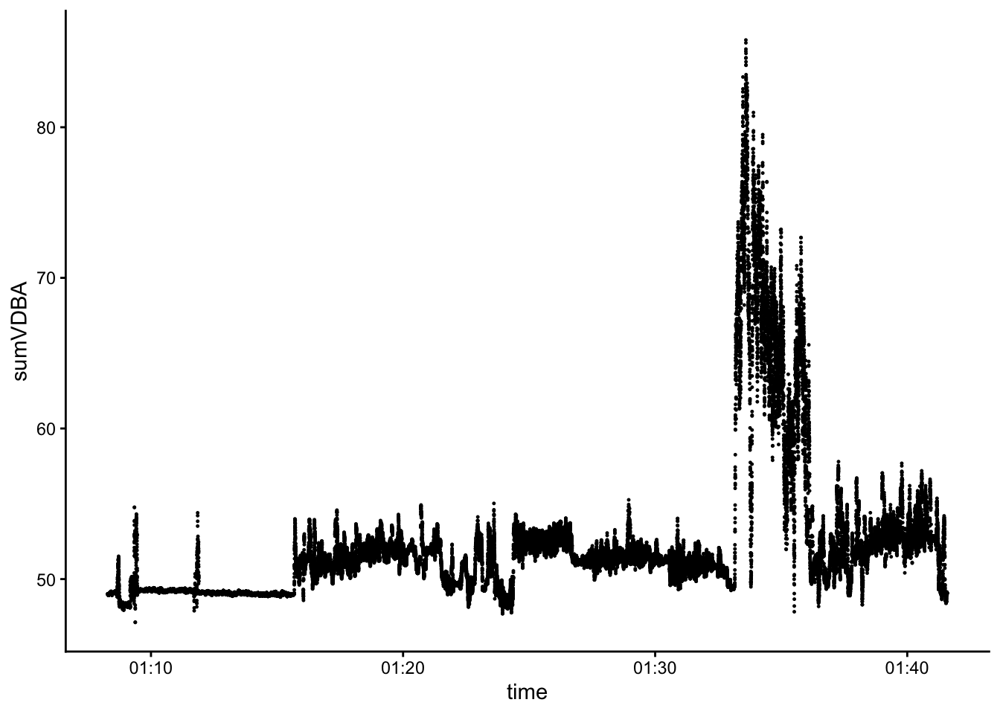

<!-- README.md is generated from README.Rmd. Please edit that file 
To regenerate, run `quarto::quarto_render("Readme.Rmd", output_file = "README.md")`
-->

# rabbit

<!-- badges: start -->

<!-- badges: end -->

The package `rabbit` provides functions to standardise raw accelerometer
data and extract movement dynamics from it. Accelerometer data is often
collected in a raw format that may not be immediately suitable for
analysis. The `standardize_data` function reads in raw accelerometer
data, standardises the column names, and converts the timestamp to a
consistent format. The `extract_movement_dynamics` function takes the
standardised data and calculates various movement dynamics metrics, such
as mean acceleration, variance, covariance, Overall Dynamic Body
Acceleration (ODBA), and Vectorial Dynamic Body Acceleration (VDBA)
using rolling window calculations. The data is then returned in a tidy
format, ready for further analysis or classification of behaviour.

Accelerometer data is often collected at high frequencies, resulting in
large datasets. The `rabbit` package is designed to efficiently process
these large datasets by leveraging the `RcppRoll` package for optimized
rolling window calculations. This allows users to quickly extract
meaningful movement dynamics metrics from their accelerometer data, even
when dealing with extensive recordings.

## Installation

You can install the development version of `rabbit` from GitHub using
the `remotes` package:

``` r
# install.packages("remotes")
remotes::install_github("traitecoevo/rabbit")
```

## Example

This is a basic example file is less than one hour of a bilby called
piccolo:

``` r
library(rabbit)
library(dplyr)

file_in = system.file("extdata", "raw_Pic2Jan_50000.parquet", package = "rabbit")

df <- 
  standardize_data(file_in = file_in, vars = c("Timestamp","accX","accY","accZ")) |> 
  extract_movement_dynamics()

nrow(df)
#> [1] 50000

df |> filter(!is.na(time))
#> # A tibble: 49,951 × 28
#>    time                meanX  meanY meanZ  maxx   maxy  maxz  minx   miny  minz    sdx     sdy    sdz   SMA
#>    <dttm>              <dbl>  <dbl> <dbl> <dbl>  <dbl> <dbl> <dbl>  <dbl> <dbl>  <dbl>   <dbl>  <dbl> <dbl>
#>  1 2078-01-03 05:16:32 0.592 -0.317 0.713  0.61 -0.297 0.735 0.563 -0.328 0.688 0.0142 0.00826 0.0119  1.62
#>  2 2078-01-03 05:16:33 0.592 -0.317 0.713  0.61 -0.297 0.735 0.563 -0.328 0.688 0.0144 0.00861 0.0124  1.62
#>  3 2078-01-03 05:16:33 0.593 -0.317 0.712  0.61 -0.297 0.735 0.563 -0.328 0.688 0.0138 0.00847 0.0124  1.62
#>  4 2078-01-03 05:16:33 0.594 -0.317 0.713  0.61 -0.297 0.735 0.563 -0.328 0.688 0.0131 0.00858 0.0119  1.62
#>  5 2078-01-03 05:16:33 0.593 -0.317 0.713  0.61 -0.297 0.735 0.563 -0.328 0.688 0.0136 0.00844 0.0119  1.62
#>  6 2078-01-03 05:16:33 0.592 -0.317 0.714  0.61 -0.297 0.735 0.563 -0.328 0.688 0.0142 0.00843 0.0116  1.62
#>  7 2078-01-03 05:16:33 0.592 -0.317 0.714  0.61 -0.297 0.735 0.563 -0.328 0.688 0.0144 0.00843 0.0116  1.62
#>  8 2078-01-03 05:16:33 0.592 -0.316 0.714  0.61 -0.297 0.735 0.563 -0.328 0.688 0.0143 0.00834 0.0115  1.62
#>  9 2078-01-03 05:16:33 0.592 -0.316 0.714  0.61 -0.297 0.735 0.563 -0.328 0.688 0.0143 0.00819 0.0115  1.62
#> 10 2078-01-03 05:16:33 0.592 -0.316 0.714  0.61 -0.297 0.735 0.563 -0.328 0.688 0.0141 0.00819 0.0119  1.62
#> # ℹ 49,941 more rows
#> # ℹ 14 more variables: minODBA <dbl>, maxODBA <dbl>, minVDBA <dbl>, maxVDBA <dbl>, sumODBA <dbl>, sumVDBA <dbl>,
#> #   meanODBA <dbl>, meanVDBA <dbl>, corXY <dbl>, corXZ <dbl>, corYZ <dbl>, skx <dbl>, sky <dbl>, skz <dbl>
```

Alternatively, you can read in the data and then standardise it:

``` r
library(arrow)
df <- arrow::read_parquet(file_in)
df_std <- standardize_data(df, vars = c("Timestamp","accX","accY","accZ"))
df_mvt <- extract_movement_dynamics(df_std)
```

## Identifying high sumVDBA times

sumVDBA is the best measure we have of heat-generating movement or
activities:

``` r
library(ggplot2)
df_mvt |> filter(!is.na(time)) |>
  ggplot(aes(x = time, y = sumVDBA)) +
  geom_point(size = 0.2) + theme_classic()
```



## Classifying behaviour

Data is now ready for classification of behaviour using your own
behavioural classifier
