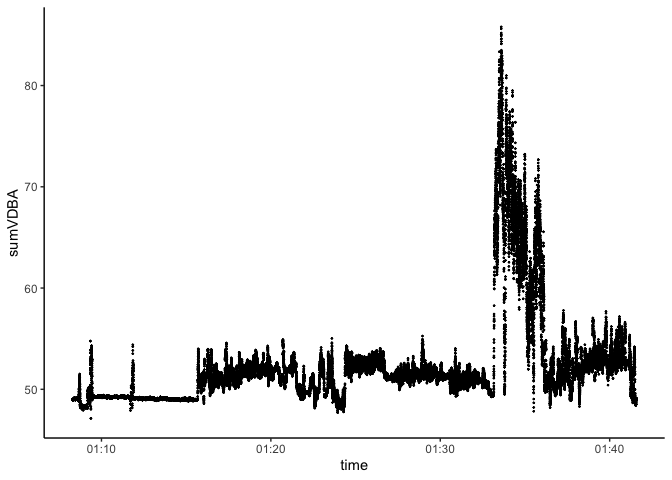

<!-- README.md is generated from README.Rmd. Please edit that file 
To regenerate, run `quarto::quarto_render("Readme.Rmd", output_file = "README.md")`
-->

# rabbit

<!-- badges: start -->
<!-- badges: end -->

The goal of rabbit is to …

Use package `RcppRoll` to optimise claulcations of metrics clculated in
wolling windows, e.g. rolling mean, var, sd etc.

## Installation

You can install the development version of rabbit from
[GitHub](https://github.com/) with:

``` r
# install.packages("devtools")
 devtools::install_github("traitecoevo/rabbit")
```

## Example

This is a basic example:

``` r
library(rabbit)
library(dplyr)
#> 
#> Attaching package: 'dplyr'
#> The following objects are masked from 'package:stats':
#> 
#>     filter, lag
#> The following objects are masked from 'package:base':
#> 
#>     intersect, setdiff, setequal, union
```

super-fast version of the rolling window calculations:

example file is less than one hour of a bilby called piccolo:

``` r
df <- arrow::read_parquet("tests/testthat/raw_Pic2Jan_50000.parquet")
nrow(df)
#> [1] 50000
```

the new version is pretty fast:

``` r
system.time(dat <- moving_window_calcs_2(df))
#>    user  system elapsed 
#>   0.300   0.015   0.319
```

## Identifying high sumVDBA times

sumVDBA is the best measure we have of heat-generating movement or
activities:

``` r
library(ggplot2)
dat %>%
  ggplot(aes(x = time, y = sumVDBA)) +
  geom_point() + theme_classic()
```



Now can classify all these movements based on a pre-built classifier
from a zoo animal:

``` r
nighttime_activities <- classify_behaviors(dat, MSOM_path = "tests/testthat/MSOM_8by7.rda")
```

we can order the activities by their estimated energy use / heat
production:

``` r
nighttime_activities <- nighttime_activities %>%
  filter(!is.na(behavior)&!is.na(sumVDBA)) %>%
  mutate(behavior = forcats::fct_reorder(behavior, sumVDBA, .fun = median, na.rm = TRUE))
```

and we can plot energy use and estimated activity through time

``` r
nighttime_activities %>%
  ggplot(aes(x = time, y = sumVDBA, col = behavior)) +
  geom_point(alpha = 0.7) + theme_classic()
```


the data seems to at a temporal resolution of 25 readings per second
which might be a lot to handle for various graphing applications. Here
is a function to take the mode of the categorical variables at a given
resolution.

``` r
window_in_minutes <- 1

minute_summary <- summary_by_time(nighttime_activities,
                                      time_col = "time",
                                      behavior_col = "behavior",
                                      window_minutes=window_in_minutes
                                      )

minute_summary %>%
ggplot(aes(x = window, y = mode_behavior, color = mode_behavior)) +
    geom_point(size = 3) +
    labs(
      x = "Time",
      y = "Mode Behavior",
      title = paste0("Most Common Behavior Within Every ", window_in_minutes, " Minute(s)")
    ) +
    theme_minimal() -> plotting
  print(plotting)
```


