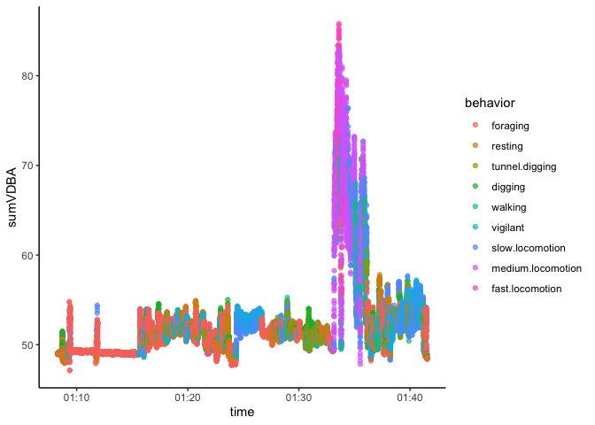

<!-- README.md is generated from README.Rmd. Please edit that file 
To regenerate, run `quarto::quarto_render("Readme.Rmd", output_file = "README.md")`
-->

# rabbit

<!-- badges: start -->
<!-- badges: end -->

The goal of rabbit is to …

Use package `RcppRoll` to optimise claulcations of metrics clculated in
wolling windows, e.g. rolling mean, var, sd etc.

## Installation

You can install the development version of rabbit from
[GitHub](https://github.com/) with:

``` r
# install.packages("devtools")
 devtools::install_github("traitecoevo/rabbit")
```

## Example

This is a basic example which shows you how to solve a common problem:

``` r
library(rabbit)
library(dplyr)
#> 
#> Attaching package: 'dplyr'
#> The following objects are masked from 'package:stats':
#> 
#>     filter, lag
#> The following objects are masked from 'package:base':
#> 
#>     intersect, setdiff, setequal, union

#Read file
data <- arrow::read_parquet("tests/testthat/raw_Pic2Jan_50000.parquet") |> slice(1:1000)

# Calcualte metrics
data_metrics <- moving_window_calcs_2(data)

data_metrics %>% slice(50:150)
#> # A tibble: 101 × 26
#>    time                meanX  meanY meanZ  maxx   maxy  maxz  minx   miny  minz
#>    <dttm>              <dbl>  <dbl> <dbl> <dbl>  <dbl> <dbl> <dbl>  <dbl> <dbl>
#>  1 2024-01-03 01:08:16 0.592 -0.317 0.713  0.61 -0.297 0.735 0.563 -0.328 0.688
#>  2 2024-01-03 01:08:17 0.592 -0.317 0.713  0.61 -0.297 0.735 0.563 -0.328 0.688
#>  3 2024-01-03 01:08:17 0.593 -0.317 0.712  0.61 -0.297 0.735 0.563 -0.328 0.688
#>  4 2024-01-03 01:08:17 0.594 -0.317 0.713  0.61 -0.297 0.735 0.563 -0.328 0.688
#>  5 2024-01-03 01:08:17 0.593 -0.317 0.713  0.61 -0.297 0.735 0.563 -0.328 0.688
#>  6 2024-01-03 01:08:17 0.592 -0.317 0.714  0.61 -0.297 0.735 0.563 -0.328 0.688
#>  7 2024-01-03 01:08:17 0.592 -0.317 0.714  0.61 -0.297 0.735 0.563 -0.328 0.688
#>  8 2024-01-03 01:08:17 0.592 -0.316 0.714  0.61 -0.297 0.735 0.563 -0.328 0.688
#>  9 2024-01-03 01:08:17 0.592 -0.316 0.714  0.61 -0.297 0.735 0.563 -0.328 0.688
#> 10 2024-01-03 01:08:17 0.592 -0.316 0.714  0.61 -0.297 0.735 0.563 -0.328 0.688
#> # ℹ 91 more rows
#> # ℹ 16 more variables: sdx <dbl>, sdy <dbl>, sdz <dbl>, SMA <dbl>,
#> #   minODBA <dbl>, maxODBA <dbl>, minVDBA <dbl>, maxVDBA <dbl>, sumODBA <dbl>,
#> #   sumVDBA <dbl>, corXY <dbl>, corXZ <dbl>, corYZ <dbl>, skx <dbl>, sky <dbl>,
#> #   skz <dbl>
```

Speed comparison on test file, comparing 3 techniques

``` r
# source("tests/testthat/doAccloop.R")
# 
# microbenchmark::microbenchmark(
#   doAccloop_all(data),
#   moving_window_calcs(data),
#   moving_window_calcs_2(data)
# )
```

Speed comparison on a big test file, comparing the 2 faster techniques

``` r

# df <- arrow::read_parquet('/Users/dfalster/GitHub/projects/Adams-Accelerometer_2024/data/Pic2Jan_S1.parquet')
# nrow(df)
```

version 1

``` r
#system.time(moving_window_calcs(df))
```

version 2

``` r
df <- arrow::read_parquet("tests/testthat/raw_Pic2Jan_50000.parquet")
system.time(dat <- moving_window_calcs_2(df))
#>    user  system elapsed 
#>   0.130   0.007   0.138
```

## Identifying high sumODBA times

``` r
library(ggplot2)
dat %>%
  ggplot(aes(x = time, y = sumVDBA)) +
  geom_point() + theme_classic()
```



``` r
nighttime_activities <- classify_behaviors(dat, MSOM_path = "tests/testthat/MSOM_8by7.rda")

nighttime_activities <- nighttime_activities %>%
  mutate(behavior = forcats::fct_reorder(behavior, sumVDBA, .fun = median, na.rm = TRUE))

nighttime_activities %>%
  filter(!is.na(behavior)) %>%
  ggplot(aes(x = time, y = sumVDBA, col = behavior)) +
  geom_point(alpha = 0.7) + theme_classic()
```


